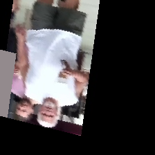

consider submission file for submission

# Results:

# Strategy:

# Data

# Data Augmentation:

As the data provided is very less,Cutout is chosen and implemented because it offers the model to look at the same data in a different way.
For example to make a decision about the gender of a person, face plays a major role. In case of face not shown in the image there are other features like dressing, ornaments etc which can be used to decide.

# Model Architecture:

Model is inspired from RESNET structure and modified with additional skip-connections at the end of very stage to the final layer so that the Model can utilize various receptive field feature maps in making decisions. This is inspired from Path Aggregation Networks.

Finally, instead of Conv2D, Depthwise Conv2D is used as convolutional layer. This type of layers facilitate in reducing the model parameter size upto 9 times. These are used in MOBILENETS.

 
